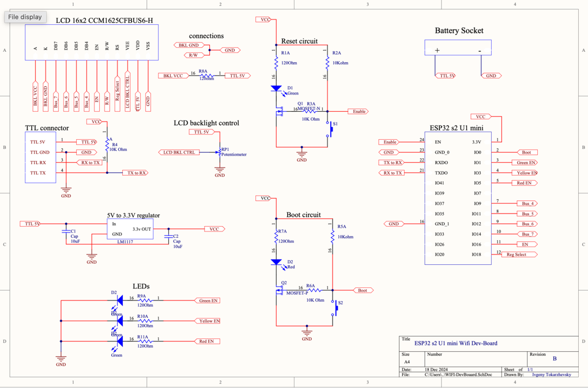

# ⚙️ ESP32-S2 Custom IoT Device Firmware

[]()
[]()
[]()
[]()
[]()

## 🧠 Overview

This repository contains the firmware for a **fully custom-designed IoT gateway board**  
based on the ESP32-S2-U1-Mini **bare SMD chip** — including PCB design, assembly, soldering and firmware development.

The device features:
- ✅ Secure cloud connectivity (MQTT over WSS)
- ✅ Battery-powered 5V system with onboard regulation
- ✅ Local LCD interface & status LEDs for standalone control
- ✅ Persistent Wi-Fi credentials storage (NVS)
- ✅ OTA firmware updates via HTTPS
- ✅ Direct register GPIO & LCD driver (no heavy libraries!)
- ✅ Full UART programming support

This firmware turns a raw ESP32-S2 chip into a **complete cloud-controlled product**.

**📸 Example - board schematic**
<br><br>

<br><br>

---

## 🔌 Hardware Overview

| Component | Function | Interface |
|----------|----------|-----------|
| ESP32-S2-U1-Mini | MCU + Wi-Fi + Flash | Main processor |
| LCD 16×2 (WH1602B-Y-JCS) | User instructions & state | 4-bit parallel |
| 5 Status LEDs | Power + Wi-Fi + MQTT + Error + Boot | GPIO |
| Reset button | Restart system | EN pin |
| Boot button | User actions (interrupt) | GPIO |
| UART header | Flashing + debugging | USB-UART programmer |
| Power input | **5V (battery supported)** | Onboard regulator → 3.3V |

**📸 Example - OTA update installed successfully**
<br><br>

<br><br>

---

## 🚨 LED Runtime Indicators

| LED | Color | Status Meaning |
|-----|------|----------------|
| Power | Green | Always ON while system powered |
| Boot | Red | ON while BOOT button pressed |
| Wi-Fi | Green | Blinking = connecting<br>Solid = connected |
| MQTT Cloud | Orange | Blinking = connecting<br>Solid = connected |
| Error | Red | Indicates fault in any subsystem |

No tools needed to understand device state.

---

## 🖲️ Button Interrupt Actions

| Action | Trigger | Result |
|--------|---------|--------|
| Reset | Short press RESET | Full system reboot |
| Wi-Fi erase | Hold BOOT for **5 sec** | Deletes all credentials → AP provisioning mode |
| Manual provisioning | Press BOOT **3× within 2 sec** | AP mode + onboarding portal |

Designed for full field-recovery without a PC or dashboard.

---

## 📶 Wi-Fi Provisioning Logic

On boot:
if (Stored Wi-Fi found)
Auto-connect → MQTT
else
Start Access Point
Host web provisioning UI (SPIFFS)
Provisioning website allows:
- SSID input
- Password entry
- Credentials saved permanently in NVS

---

## ☁ Cloud Communication – MQTT/WSS

After Wi-Fi:
- Secure WebSocket connection to HiveMQ Cloud
- Publishes online state
- Subscribes to control topics
- Two-way real-time messaging with dashboard

📍 Dashboard repository:  
https://github.com/IvgenyDevT/esp32_IoT_cloud_dashboard.git

---

## 🔄 OTA Firmware Updates

Triggered from dashboard:

1. Dashboard sends OTA command + URL
2. ESP32 downloads binary via HTTPS
3. Writes to OTA partition
4. Auto-reboot into new version
5. Reports status via MQTT

Rollback safe.

---

## 🧱 Flash Partition Layout
| Bootloader                            |

| Partition Table                       |

| Factory App / OTA Slot A              |

| OTA Slot B (updates)                  |

| SPIFFS (Web provisioning portal)      |

| NVS (Persistent Wi-Fi credentials)    |
---

## 🧩 System Architecture

```markdown
Local User (LCD + Buttons)
         │
         ▼
ESP32-S2 IoT Device
         │
         ▼
Wi-Fi ↔ Cloud MQTT Broker ↔ Web Dashboard UI
Event-driven FreeRTOS tasks manage:
	•	LCD updates
	•	Networking
	•	MQTT callbacks
	•	Interrupt handling
	•	LED state machine
```
⸻

## 📂 Project Structure

```bash
firmware/
├── CMakeLists.txt
├── main/
│   ├── hardware_layer.c          # Low-level GPIO and hardware access
│   ├── http_server.c             # Local provisioning web portal (SPIFFS)
│   ├── interrupts.c              # ISR handlers for BOOT/RESET logic
│   ├── lcd_driver.c              # WH1602B 16x2 LCD driver (4-bit)
│   ├── leds_driver.c             # Status indicators (GPIO)
│   ├── main.c                    # App entry point + system state logic
│   ├── mqtt_callbacks.c          # MQTT event callbacks
│   ├── mqtt_manager.c            # MQTT client controller
│   ├── nvs_memory.c              # Persistent storage: SSID/PWD
│   ├── util.c                    # Utility helpers
│   ├── web_application.c         # Captive portal logic + UI serving
│   ├── WiFi_callbacks.c          # Wi-Fi state event handlers
│   ├── wifi_manager.c            # Wi-Fi scanning + connect routines
│
│   ├── config.h
│   ├── credentials.h
│   ├── hardware_config.h
│   ├── hardware_layer.h
│   ├── http_server.h
│   ├── interrupts.h
│   ├── lcd_driver.h
│   ├── leds_driver.h
│   ├── main.h
│   ├── mqtt_callbacks.h
│   ├── mqtt_manager.h
│   ├── nvs_memory.h
│   ├── util.h
│   ├── web_application.h
│   ├── wifi_callbacks.h
│   └── wifi_manager.h
└── sdkconfig
```
## 🛠 Development

Requirements
- ESP-IDF v5.1
- -to-UART adapter (CP2102 / FTDI / CH340 etc.)
- power supply or battery pack

Flash & Serial Monitor
idf.py -p /dev/ttyUSB0 flash monitor
Ctrl + ] to exit monitor.

---

## ✅ Feature Summary

| Feature | Status |
|--------|--------|
| Battery-powered custom PCB | ✅ |
| Direct register drivers | ✅ |
| LCD UI system | ✅ |
| Smart Wi-Fi provisioning | ✅ |
| MQTT cloud lifecycle | ✅ |
| OTA firmware updates | ✅ |
| LED runtime indicators | ✅ |
| Button interrupts | ✅ |
| Persistent storage in NVS | ✅ |
| SPIFFS-hosted provisioning UI | ✅ |

⚡ This firmware behaves like a complete production IoT device.

🚀 Future Enhancements
•	Additional onboard sensors (Temp, Humidity, Motion)
•	Encrypted configuration portal
•	Remote logging & graphs
•	Dual-cloud fallback
•	Over-the-air partition switching improvements

⸻

👤 Author

Ivgeny Tokarzhevsky
Embedded Software · IoT Developer · Hardware Engineer

Hardware + firmware + dashboard —
engineered entirely from scratch, end-to-end.

⸻
